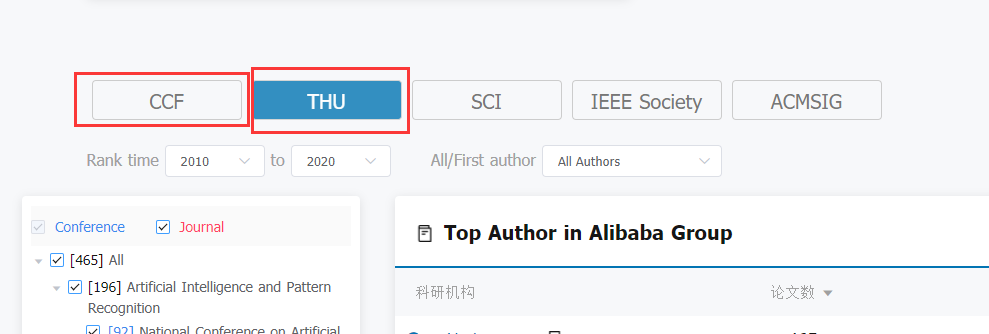
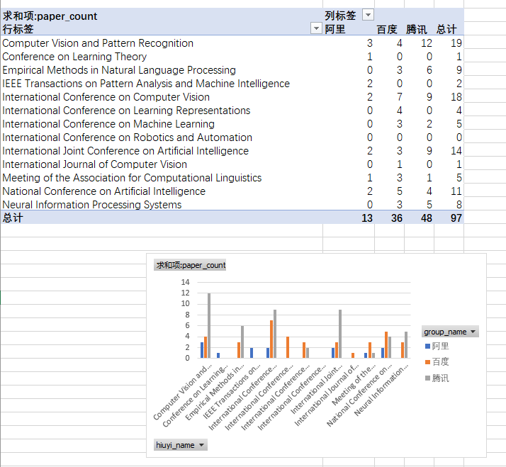

# 数据来源
https://www.acemap.info/

- [百度数据来源](https://www.acemap.info/aff/2100597028)	
- [腾讯数据来源](https://www.acemap.info/aff/2102136657)	
- [阿里数据来源](https://www.acemap.info/aff/2101566148)	

有两种顶级会议论文的收录列表`CFF`和`THU`

# 统计结果 excel打开
- `paper_分析.xlsx`->透视表中 

# 原始爬虫数据
- `总_paper.csv`
    - `cff_paper.csv`
    - `hut_paper.csv`
- `总_paper_删除都为0的项.csv`

# 说明
- 没找到`字节跳动`在cemap里面的主页，这个公司也不向外界写新闻宣传,这个公司好像是实用主义，一般论文发的少

- 脚本在：`爬虫_jupyternotebook`

